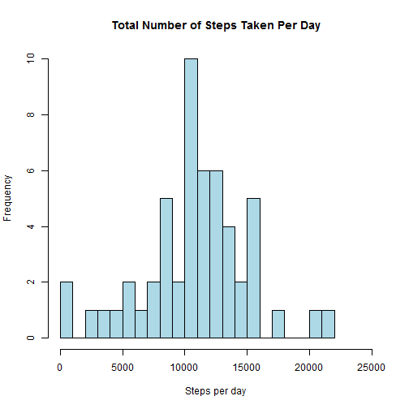

Reproducible Data, Peer Assessment 1
====================================


This report answers questions related to the "Activity monitoring data set". 


## Loading and preprocessing the data
The data set was loaded using read.csv as below and the date column was 
transformed into the class 'date'.


```r
activity <- read.csv("activity.csv")
```

```
## Warning in file(file, "rt"): cannot open file 'activity.csv': No such file
## or directory
```

```
## Error in file(file, "rt"): cannot open the connection
```

```r
activity$date <- as.Date(activity$date)
```


## What is mean total number of steps taken per day?
A histogram plot shows the total number of steps taken each day.

```r
stepsPerDay <- aggregate(steps ~ date, activity, FUN = sum)
hist(stepsPerDay$steps,
     breaks = 20,
     xlab = "Steps per day",
     xlim = c(0, 25000),
     main = "Total Number of Steps Taken Per Day",
     col = "lightblue",
     border = "black"
     )
```



The mean and median of the total number of steps per day are:

```r
mean(stepsPerDay$steps)
```

```
## [1] 10766.19
```

```r
median(stepsPerDay$steps)
```

```
## [1] 10766.19
```


## What is the average daily activity pattern?
A time-series plot of the 5-minute interval (x-axis) and the average number of steps taken, averaged across all days (y-axis)

```r
avgSteps <- aggregate(steps ~ interval, activity, FUN = mean, na.rm = TRUE) 
                                               
plot(avgSteps$interval, avgSteps$steps,
     type = "l",
     las = 1,
     col = "darkblue",
     main = "Average Number of Steps per 5-minutes",
     xlab = "5-min intervals",
     ylab = "average number of steps"
     )                
```


The 5-minute interval that contains the maximum number of steps is number 835
and it corresponds to 206 steps. 

```r
maxSteps <- which.max(avgSteps$steps)
avgSteps[maxSteps, ]
```

```
##     interval    steps
## 104      835 184.0338
```


## Imputing missing values

The total number of missing values in the dataset is (absolut number followed 
by %)

```r
numberNA <- sum(is.na(activity$steps))
numberNA
```

```
## [1] 0
```

```r
numberNA / length(activity$steps) * 100
```

```
## [1] 0
```

The mean step value for each day was used to impede the NAs of the same day

```r
NAs <- which(is.na(activity$steps))
l <- length(NAs)
avSteps <- with(activity, tapply(steps, date, mean, na.rm = TRUE))
na <- mean(avSteps, na.rm = TRUE)
for(i in 1:l) {
        activity[NAs[i], 1] <- na
}
```

```
## Error in `[<-.data.frame`(`*tmp*`, NAs[i], 1, value = 37.3825995807128): missing values are not allowed in subscripted assignments of data frames
```
A histogram showing the total number of steps taken each day after NAs were 
replaced by the daily average. 

```r
stepsPerDay2 <- aggregate(steps ~ date, activity, FUN = sum)
hist(stepsPerDay2$steps,
     breaks = 20,
     xlab = "Steps per day",
     xlim = c(0, 25000),
     main = "Total Number of Steps Taken Per Day",
     col = "orange",
     border = "black"
)
```


The mean and median values have changed slightly from before NAs were impeded. 
The new values are:

```r
mean(stepsPerDay2$steps)
```

```
## [1] 10766.19
```

```r
median(stepsPerDay2$steps)
```

```
## [1] 10766.19
```


## Are there differences in activity patterns between weekdays and weekends?


The mean number of steps during weekdays and during weekends are shown in the graph below. 


```r
library(ggplot2)
library(plyr)

dayType <- function(date)
        if(weekdays(date) %in% c("Saturday", "Sunday")) "weekend" else "weekday"
activity$day.type <- as.factor(sapply(activity$date, dayType))
stepsPerDaytype <- ddply(activity, .(interval, day.type), summarize, 
                         steps = mean(steps))
ggplot(stepsPerDaytype, aes(interval, steps)) + 
        geom_line() + facet_grid(day.type ~ .) +
        labs(x = "Interval", y = "Number of steps",
             title = "Activity patterns weekdays vs. weekends")
```


